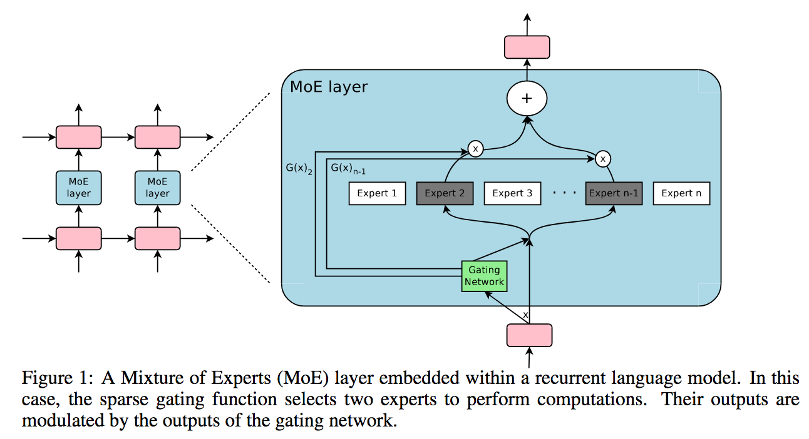

</img>

## Sparsely Gated Mixture of Experts - Pytorch

A Pytorch implementation of Sparsely Gated <a href="https://arxiv.org/abs/2006.16668">Mixture of Experts</a>, for massively increasing the capacity (parameter count) of a language model while keeping the computation constant.

It will mostly be a line-by-line transcription of the tensorflow implementation <a href="https://github.com/tensorflow/tensor2tensor/blob/master/tensor2tensor/models/research/moe.py">here</a>, with a few enhancements.

Update: You should now use <a href="https://github.com/lucidrains/st-moe-pytorch">ST Mixture of Experts</a>

[](https://badge.fury.io/py/mixture-of-experts)

## Install

```bash
$ pip install mixture_of_experts
```


## Citation

```bibtex
@misc{shazeer2017outrageously,
    title   = {Outrageously Large Neural Networks: The Sparsely-Gated Mixture-of-Experts Layer},
    author  = {Noam Shazeer and Azalia Mirhoseini and Krzysztof Maziarz and Andy Davis and Quoc Le and Geoffrey Hinton and Jeff Dean},
    year    = {2017},
    eprint  = {1701.06538},
    archivePrefix = {arXiv},
    primaryClass = {cs.LG}
}
```

```bibtex
@misc{lepikhin2020gshard,
    title   = {GShard: Scaling Giant Models with Conditional Computation and Automatic Sharding},
    author  = {Dmitry Lepikhin and HyoukJoong Lee and Yuanzhong Xu and Dehao Chen and Orhan Firat and Yanping Huang and Maxim Krikun and Noam Shazeer and Zhifeng Chen},
    year    = {2020},
    eprint  = {2006.16668},
    archivePrefix = {arXiv},
    primaryClass = {cs.CL}
}
```

